# Higgsfield → YouTube Shorts Auto-Publisher

An n8n workflow that generates a short-form video concept, renders it with
Higgsfield, and publishes it to a YouTube channel as a Short — on a daily
schedule.

## Pipeline

```mermaid
flowchart LR
    A[Daily Trigger] --> B[Generate Script & Metadata\nClaude]
    B --> C[Parse Script JSON]
    C --> D[Create Higgsfield Job]
    D --> E[Init Poll State]
    E --> F[Wait 15s]
    F --> G[Check Higgsfield Status]
    G --> H[Evaluate Status]
    H --> I{Route by Status}
    I -- Completed --> J[Download Video]
    I -- Pending --> F
    I -- Failed/Timeout --> K[Format Failure Notice]
    J --> L[Upload Short to YouTube]
    L --> M[Log Published Short]
    M --> N[Notify Success]
    L -- error --> K
    K --> O[Notify Failure]
```

## Import

1. Open n8n → Workflows → Import from File → select `workflow.json`.
2. Assign credentials on each node (n8n will prompt you):
   - **Anthropic** (`anthropicApi`) on "Generate Script & Metadata (Claude)".
   - **Higgsfield API** (`httpHeaderAuth`, header `Authorization` =
     `Key <KEY_ID>:<KEY_SECRET>`) on "Create Higgsfield Job" and
     "Check Higgsfield Status".
   - **YouTube OAuth2** (`youTubeOAuth2Api`, scope
     `https://www.googleapis.com/auth/youtube.upload`) on
     "Upload Short to YouTube".
   - **SMTP** on "Notify Success" / "Notify Failure" (or swap those two nodes
     for Slack/Telegram if you prefer).
   - **Google Sheets** on "Log Published Short" (or delete that node if you
     don't want a log).

## Before you run it

- **Higgsfield endpoint**: the "Create Higgsfield Job" node's URL has a
  placeholder (`REPLACE_WITH_TEXT_TO_VIDEO_ENDPOINT`). Higgsfield's official
  API reference wasn't fetchable at build time (docs pages returned 403 to
  automated fetches), so confirm the exact endpoint path and JSON payload
  shape from your Higgsfield dashboard/API docs before running. The
  polling shape (`GET /v1/requests/{request_id}/status`, statuses
  `queued` / `in_progress` / `completed` / `failed` / `nsfw`) matches
  Higgsfield's published SDK behavior.
- **Google Sheets fields**: `documentId` / `sheetName` have placeholder
  values — pick your spreadsheet in the n8n editor after import.
- **categoryId**: defaults to `24` (Entertainment) on the YouTube upload node;
  change it via the node's dropdown if you want a different category.
- **Privacy**: uploads default to `privacyStatus: private` so you can review
  each Short before publishing. Switch to `public` once you trust the
  pipeline's output quality.
- **Poll timeout**: the loop gives up after ~10 minutes of polling
  (`elapsed_ms > 600000`) and routes to the failure branch, so a stuck
  Higgsfield render can't hang the workflow indefinitely.

## Customizing

- Swap the Anthropic HTTP Request node for the native Anthropic node (or an
  OpenAI/Codex call) if you'd rather not hit the Messages API directly.
- The "Format Failure Notice" node is a single merge point for every error
  branch (script generation, job creation, polling, download, upload) — wire
  in Slack/PagerDuty there for real alerting.
