# Higgsfield → YouTube Shorts Auto-Publisher

An n8n workflow that generates a short-form video concept, renders it with
Higgsfield, and publishes it to a YouTube channel as a Short — on a daily
schedule.

## Why two Higgsfield jobs, not one

Higgsfield has no single "text-to-video" call. Its actual generation surface
(confirmed by reading the official `higgsfield-ai/higgsfield-js` SDK source
on GitHub, not just its README) is:

1. **Text-to-image** — `POST /flux-pro/kontext/max/text-to-image`
2. **Image-to-video** — `POST /v1/image2video/dop` (the "DoP" camera-motion
   model), which animates the image from step 1

Both jobs are polled the same way and share the same response shape:

| Fact | Value | Source |
|---|---|---|
| Base URL | `https://platform.higgsfield.ai` | `src/config.ts` |
| Auth header | `Authorization: Key {KEY_ID}:{KEY_SECRET}` | `src/v2/client.ts` |
| Poll endpoint | `GET /requests/{request_id}/status` | `src/models/JobSet.ts` (V2 polling path) |
| Status values | `queued`, `in_progress`, `completed`, `failed`, `nsfw`, `canceled` | `src/v2/types.ts` (`V2Response`) |
| Job creation response | `{ status, request_id, status_url, cancel_url, images?, video? }` | `src/v2/types.ts` (`V2Response`) |
| Completed image result | `images[0].url` | `src/v2/types.ts` |
| Completed video result | `video.url` | `src/v2/types.ts` |

## Pipeline

```mermaid
flowchart LR
    A[Daily Trigger] --> B[Generate Script & Metadata\nClaude]
    B --> C[Parse Script JSON]
    C --> D[Create Higgsfield Image Job]
    D --> E[Init Image Poll State]
    E --> F[Wait 10s]
    F --> G[Check Image Status]
    G --> H[Evaluate Image Status]
    H --> I{Route Image Status}
    I -- Pending --> F
    I -- Failed/Timeout --> X[Format Failure Notice]
    I -- Completed --> J[Create Higgsfield Video Job - DoP]
    J --> K[Init Video Poll State]
    K --> L[Wait 15s]
    L --> M[Check Video Status]
    M --> N[Evaluate Video Status]
    N --> O{Route Video Status}
    O -- Pending --> L
    O -- Failed/Timeout --> X
    O -- Completed --> P[Download Video]
    P --> Q[Upload Short to YouTube]
    Q --> R[Log Published Short]
    R --> S[Notify Success]
    Q -- error --> X
    X --> T[Notify Failure]
```

## Import

1. Open n8n → Workflows → Import from File → select `workflow.json`.
2. Assign credentials on each node (n8n will prompt you):
   - **Anthropic** (`anthropicApi`) on "Generate Script & Metadata (Claude)".
   - **Higgsfield API** (`httpHeaderAuth` credential — header name
     `Authorization`, value `Key <KEY_ID>:<KEY_SECRET>`) on the four
     Higgsfield HTTP Request nodes.
   - **YouTube OAuth2** (`youTubeOAuth2Api`, scope
     `https://www.googleapis.com/auth/youtube.upload`) on
     "Upload Short to YouTube".
   - **SMTP** on "Notify Success" / "Notify Failure" (or swap those two nodes
     for Slack/Telegram).
   - **Google Sheets** on "Log Published Short" (or delete that node).

## Before you run it

- **Google Sheets fields**: `documentId` / `sheetName` have placeholder
  values — pick your spreadsheet in the n8n editor after import.
- **categoryId**: defaults to `24` (Entertainment) on the YouTube upload
  node; change it via the node's dropdown for a different category.
- **Privacy**: uploads default to `privacyStatus: private` so you can review
  each Short before it's public. Switch to `public` once you trust the
  pipeline's output.
- **Poll timeouts**: image generation gives up after 5 minutes, video
  generation after 10 minutes, both routing to the failure branch instead of
  hanging indefinitely.
- **`dop-turbo` model / camera motion**: Claude generates a `camera_motion`
  field (e.g. "slow dolly in, subtle parallax") used as the DoP prompt. Check
  your Higgsfield dashboard for other available DoP model variants if
  `dop-turbo` doesn't fit your use case or plan.
- Endpoint paths, auth, and response shapes above were verified by reading
  `higgsfield-js` source directly — I could not reach `platform.higgsfield.ai`'s
  own docs pages (403 on automated fetch) or the Python `higgsfield-client`
  repo's actual source, so double-check the Node SDK hasn't drifted from the
  live API before relying on this in production.

## Customizing

- Swap the Anthropic HTTP Request node for the native Anthropic node (or an
  OpenAI/Codex call) if you'd rather not hit the Messages API directly.
- "Format Failure Notice" is a single merge point for every error branch
  (script generation, both Higgsfield jobs, download, upload) — wire in
  Slack/PagerDuty there for real alerting.

## Sources consulted

- https://github.com/higgsfield-ai/higgsfield-js (`src/config.ts`,
  `src/v2/client.ts`, `src/v2/types.ts`, `src/models/JobSet.ts`, README)
- https://github.com/higgsfield-ai/higgsfield-client (Python SDK README)
