# Higgsfield → YouTube Shorts Auto-Publisher

An n8n workflow that generates a short-form video concept, renders it with
Higgsfield, and publishes it to a YouTube channel as a Short — on a daily
schedule.

## Why two Higgsfield jobs, not one

Higgsfield has no single "text-to-video" call. Its actual generation surface
uses a unified "new API": `POST /{model_id}` with a **flat** JSON body (no
wrapper key), polled the same way for every model:

1. **Text-to-image** — `POST /bytedance/seedream/v4/text-to-image`
2. **Image-to-video** — `POST /higgsfield-ai/dop/standard` (the "DoP" model),
   which animates the image from step 1

This was cross-checked against two independent sources so the request/response
shapes aren't a guess:

| Fact | Value | Source |
|---|---|---|
| Base URL | `https://platform.higgsfield.ai` | `higgsfield-js/src/config.ts`; `higgsfield-mcp/src/client.js` |
| Auth header | `Authorization: Key {KEY_ID}:{KEY_SECRET}` | `higgsfield-js/src/v2/client.ts`; `higgsfield-mcp` also sends `hf-api-key`/`hf-secret` as a fallback scheme |
| Request body shape | Flat — `generate(endpoint, {input})` spreads `input`'s fields directly onto the wire, no `{input: ...}` wrapper | `higgsfield-js/src/v2/client.ts` (`const requestBody = {...input}`) |
| Poll endpoint | `GET /requests/{request_id}/status` | `higgsfield-js/src/models/JobSet.ts` (V2 polling path); `higgsfield-mcp`'s `get_request_status` tool |
| Status values | `queued`, `in_progress`, `completed`, `failed`, `nsfw`, plus `canceled`/`cancelled` (spelling differs between sources) | `higgsfield-js/src/v2/types.ts`; `higgsfield-mcp/src/server.js` |
| Job creation / status response | `{ status, request_id, status_url, cancel_url, images?, video? }` | `higgsfield-js/src/v2/types.ts` |
| Completed image result | `images[0].url` | both sources |
| Completed video result | `video.url` | both sources |
| `dop/standard` params | `{ image_url, prompt, duration }` (duration 2-10s, optional) | `higgsfield-mcp/src/client.js` + its `generate_video_dop_standard` tool's zod schema |
| `seedream` params | `{ prompt, aspect_ratio, resolution, camera_fixed? }`, `aspect_ratio` enum includes `9:16` | `higgsfield-mcp`'s `generate_image_seedream` tool's zod schema |

An earlier version of this workflow used `flux-pro/kontext/max/text-to-image`
and the legacy motion-ID-based `/v1/image2video/dop` with a `{input: {...}}`
wrapper — that wrapper was wrong (confirmed once the SDK's actual body-building
code was read) and the legacy DoP path needlessly required a `motion_id`
looked up from `/v1/motions`. `dop/standard` (new API) needs no motion lookup.

## Pipeline

```mermaid
flowchart LR
    A[Daily Trigger] --> B[Generate Script & Metadata\nClaude]
    B --> C[Parse Script JSON]
    C --> D[Create Higgsfield Image Job]
    D --> E[Init Image Poll State]
    E --> F[Wait 10s]
    F --> G[Check Image Status]
    G --> H[Evaluate Image Status]
    H --> I{Route Image Status}
    I -- Pending --> F
    I -- Failed/Timeout --> X[Format Failure Notice]
    I -- Completed --> J[Create Higgsfield Video Job - DoP Standard]
    J --> K[Init Video Poll State]
    K --> L[Wait 15s]
    L --> M[Check Video Status]
    M --> N[Evaluate Video Status]
    N --> O{Route Video Status}
    O -- Pending --> L
    O -- Failed/Timeout --> X
    O -- Completed --> P[Download Video]
    P --> Q[Upload Short to YouTube]
    Q --> R[Log Published Short]
    R --> S[Notify Success]
    Q -- error --> X
    X --> T[Notify Failure]
```

## Import

1. Open n8n → Workflows → Import from File → select `workflow.json`.
2. Assign credentials on each node (n8n will prompt you):
   - **Anthropic** (`anthropicApi`) on "Generate Script & Metadata (Claude)".
   - **Higgsfield API** (`httpHeaderAuth` credential — header name
     `Authorization`, value `Key <KEY_ID>:<KEY_SECRET>`) on the four
     Higgsfield HTTP Request nodes. If you get 401s, some endpoints also
     accept separate `hf-api-key` / `hf-secret` headers — add those as extra
     static headers on the node if the single `Authorization` header isn't
     enough for your account.
   - **YouTube OAuth2** (`youTubeOAuth2Api`, scope
     `https://www.googleapis.com/auth/youtube.upload`) on
     "Upload Short to YouTube".
   - **SMTP** on "Notify Success" / "Notify Failure" (or swap those two nodes
     for Slack/Telegram).
   - **Google Sheets** on "Log Published Short" (or delete that node).

## Before you run it

- **Google Sheets fields**: `documentId` / `sheetName` have placeholder
  values — pick your spreadsheet in the n8n editor after import.
- **categoryId**: defaults to `24` (Entertainment) on the YouTube upload
  node; change it via the node's dropdown for a different category.
- **Privacy**: uploads default to `privacyStatus: private` so you can review
  each Short before it's public. Switch to `public` once you trust the
  pipeline's output.
- **Poll timeouts**: image generation gives up after 5 minutes, video
  generation after 10 minutes, both routing to the failure branch instead of
  hanging indefinitely.
- **Camera motion**: Claude generates a `camera_motion` field (e.g. "slow
  dolly in, subtle parallax") used as the DoP Standard prompt. There are also
  Kling (`kling-video/v2.1/pro/image-to-video`) and Seedance
  (`bytedance/seedance/v1/pro/image-to-video`) image-to-video models on the
  same unified API with the same flat `{image_url, prompt}` shape, if you
  want to try an alternative to Higgsfield's own DoP model.
- This has been cross-checked against two independent implementations
  (official SDK source + a third-party MCP server's working client code) but
  neither is Higgsfield's own docs site, which 403'd every automated fetch
  attempt — spot-check against your dashboard before relying on this in
  production.

## Customizing

- Swap the Anthropic HTTP Request node for the native Anthropic node (or an
  OpenAI/Codex call) if you'd rather not hit the Messages API directly.
- "Format Failure Notice" is a single merge point for every error branch
  (script generation, both Higgsfield jobs, download, upload) — wire in
  Slack/PagerDuty there for real alerting.

## Sources consulted

- https://github.com/higgsfield-ai/higgsfield-js (`src/config.ts`,
  `src/v2/client.ts`, `src/v2/types.ts`, `src/models/JobSet.ts`, README)
- https://github.com/higgsfield-ai/higgsfield-client (Python SDK README)
- [`higgsfield-mcp`](https://github.com/Storyvord/higgsfield-mcp) npm package
  (`src/client.js`, `src/server.js`) — a third-party MCP server wrapping the
  same API, installed locally (`npm install -g higgsfield-mcp`) and read
  directly to cross-check endpoint paths, body shapes, and valid parameter
  enums against the official SDK.
